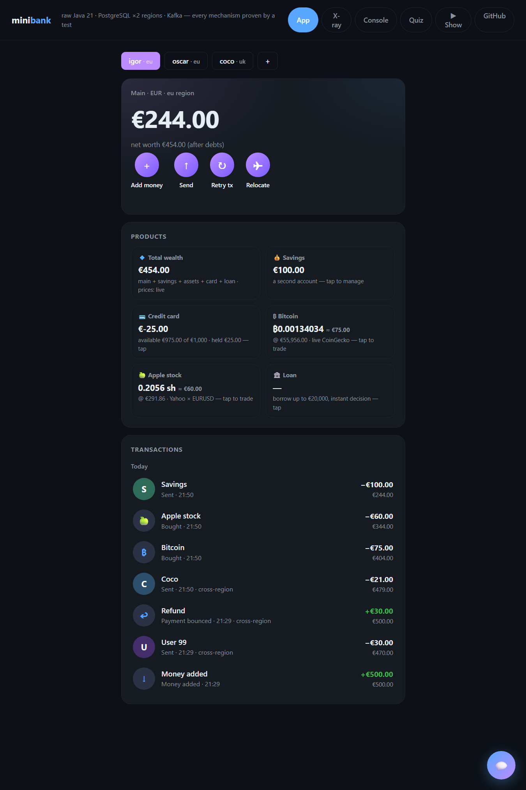
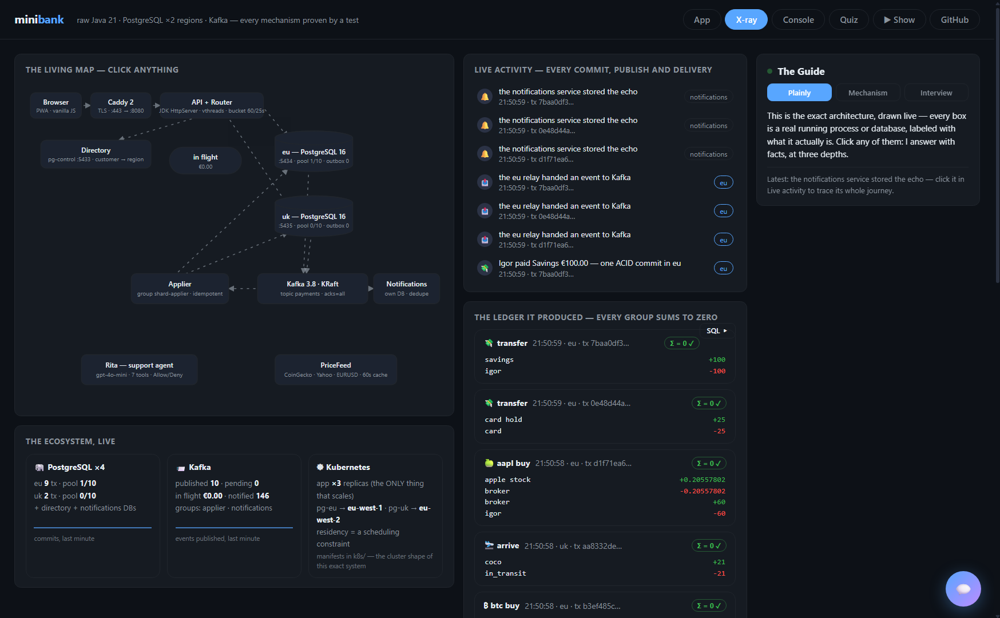
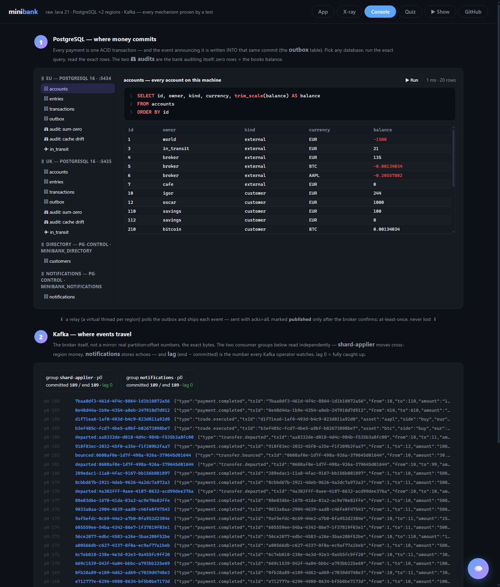
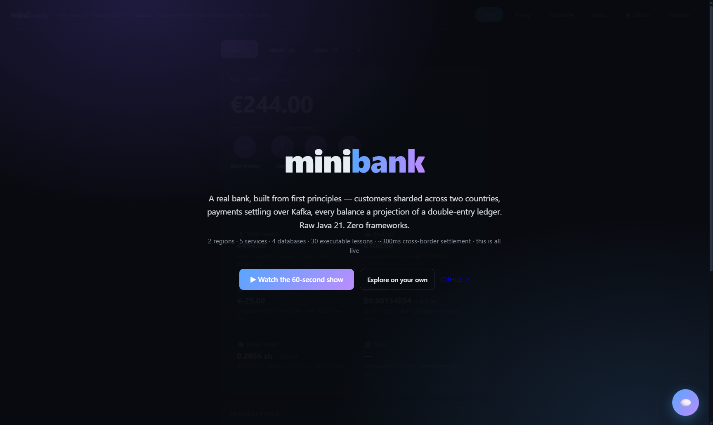
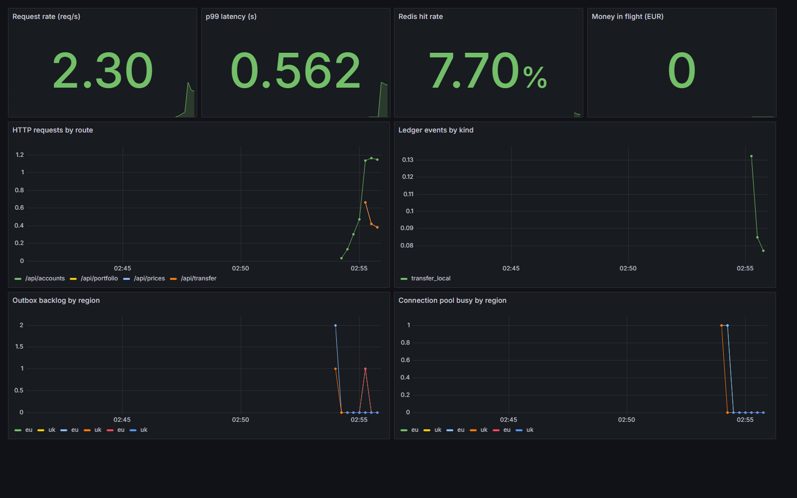

# minibank

A neobank built from first principles, one lesson at a time. **Raw Java 21, no frameworks** · PostgreSQL · Kafka · Redis · Kubernetes · Prometheus + Grafana · Flyway · JUnit + Spock.

> Learning project: each stage builds one real piece of a modern fintech backend and **proves one system-design concept with a runnable demo**. Inspired by how contemporary neobanks are engineered (microservices, database-per-service, event-driven consistency, and in-house tooling over frameworks). Not affiliated with any bank.

**LIVE: [bank.b4rruf3t.com](https://bank.b4rruf3t.com)**. Or jump straight to the self-driving demo: **[bank.b4rruf3t.com/#show](https://bank.b4rruf3t.com/#show)** (60 seconds, it sends real money and narrates itself).



## What's inside

| Tab | What it is |
|---|---|
| **App** | A working neobank: customers in two REGIONS (eu/uk on separate Postgres servers), instant in-region payments, cross-region payments that settle over Kafka (honestly `Pending` until the arrival commits), savings, a credit card with a real authorize/capture/release lifecycle, Bitcoin & Apple stock on a **multi-currency ledger at live prices**, personal loans, external IBAN transfers, self-serve signup with a residency choice, PWA install, and **Rita**, an LLM support agent with the same powers as the buttons, gated by an Allow/Deny card on every action. |
| **X-ray** | The exact architecture, drawn live: every real process and database as a labeled node, particle animations replaying real events, distributed **tracing assembled from the timestamps the system already writes**, a per-component row inspector, live invariant audits, and a Guide that explains anything clicked at three depths (Plainly / Mechanism / Interview answer). |
| **Console** | The pipeline as a page: **SQL Studio** (the four real databases, IDE-style: exact queries, syntax-highlighted, timed, zero injection surface) flowing into the **Kafka Console** (the broker itself: true offsets, the exact bytes, and live consumer-group LAG from the admin API). |
| **Quiz** | 24 questions the site asks about its own architecture. Pass the bank's quiz and you understand the bank. |

| The living X-ray | The Console pipeline |
|---|---|
|  |  |



## Runs on Kubernetes (and it's observable)

The public demo runs on Docker Compose on one box, but the manifests in [`k8s/`](k8s/) actually deploy. One command, `./k8s/run-local.sh`, builds the image and stands the whole bank up on a real 3-node [k3s](https://k3s.io) cluster: the app tier as 3 stateless replicas, Postgres per region pinned by `nodeSelector` so **data residency is a scheduling constraint the cluster cannot violate**, KRaft Kafka, Redis, the FX microservice, and a full **Prometheus + Grafana** stack. Prometheus discovers and scrapes each app pod; Grafana graphs it from a version-controlled dashboard.



The app itself exposes a hand-written **`/metrics`** endpoint (Prometheus text format, no client library): request counters, a latency histogram, cache hit/miss, FX outcomes, and live gauges for money-in-flight, pool usage and outbox backlog. **Redis** is a read-through cache in front of prices and market data (two levels: in-process L1, shared L2), and it fails open, the bank is correct without it and merely faster with it. **Flyway** owns every database's schema as versioned SQL, browsable live in SQL Studio.

## Doctrine: no frameworks

Everything a framework would hand us invisibly, we build visibly, when the lesson calls for it:

| A framework gives you | We instead | Stage |
|---|---|---|
| connection pool (auto) | feel the pain of connection-per-query, then write a tiny pool, then PgBouncer | 0 → 4 |
| transaction management | explicit `setAutoCommit(false)` … `commit()` / `rollback()` | 0 |
| schema init | we run our own DDL | 0 |
| HTTP endpoints | JDK's built-in `HttpServer` + virtual threads | 2 |
| Kafka magic | raw producer/consumer + a hand-written transactional outbox | 2 |

Dependencies so far: the Postgres driver and JUnit. That's it.

## Decision log

Every design decision is recorded and argued; the point of this repo is understanding, not shipping.

- **D1** Raw JDBC via `DriverManager`, one connection per call, *deliberately naive*; stage 4 measures the cost and fixes it.
- **D2** Each racing test thread gets its own connection; sharing one connection would queue, not race; real systems race because every request has its own connection.
- **D3** Stage 0 stores balance as a mutable column, *deliberately wrong*; stage 1 replaces it with an append-only ledger and shows why.
- **D4** (Igor) Ledger schema: double-entry with a cached balance, built as pure double-entry first, cache derived after, chosen to maximise interview-relevant depth: the sum-to-zero invariant, truth-vs-projection, and reconciliation.
- **D5** Money only enters the bank by transfer: accounts are born empty and the external *world* account funds them (going negative, its job). Keeps the invariant pure: cache == SUM(entries), always, for everyone.
- **D6** Business rules live in the schema: the balance check is kind-aware: customers never negative, externals unbounded.
- **D8** Events are written into the SAME database transaction as the money (the transactional outbox); a relay ships them to Kafka afterwards. You cannot commit atomically across two systems, so we only ever commit to one.
- **D9** Delivery is at-least-once by design (mark-after-send); every consumer is idempotent (event key = primary key + ON CONFLICT DO NOTHING). Loss is impossible, duplicates are harmless.
- **D10** database-per-service: the notifications consumer owns its own database; the only bridge between services is the topic.
- **D11** The pool hands out PROXIES whose close() returns the connection instead of closing it, so every existing try-with-resources kept working, unchanged, when the bank flipped to pooling. On every return the pool rolls back any open transaction and resets autocommit: state never leaks between borrowers.
- **D12** `Db.open()` transparently serves pooled connections once `Db.usePool(n)` runs; `Db.openPhysical()` keeps the naive path alive so the lessons can keep measuring the tax.
- **D13** PgBouncer runs in transaction pooling mode; the JDBC gotcha is server-side prepared statements, disarmed with `prepareThreshold=0` in the URL.
- **D14** Shard by CUSTOMER id (demo: id mod 2: igor even → shard 0, coco odd → shard 1, so the demo exercises the hard path by default). The reason is precise: the only decision that can FAIL (does the payer have the money) always stays local to one shard, under a plain row lock. Credits cannot fail. No distributed locking exists anywhere. Region sharding is this idea with residency law satisfied by the key.
- **D15** Cross-shard transfer = SAGA, not two-phase commit: depart (local ACID: payer −A, in_transit +A, outbox event in the same commit) → Kafka → arrive (local ACID on the destination shard, gated by the same txId on ITS transactions table). 2PC blocks both shards while a coordinator decides and the coordinator is a new single point of failure; the saga keeps every transaction local and pays with a visible, honest in-between state.
- **D16** in_transit is a CLEARING account on every shard: the double-entry way to say "in the pipe". Each shard's books sum to zero at every instant; the fleet-wide SUM of in_transit balances = money in flight right now, zero when drained. That one number is the cross-shard reconciliation control (banks call the pattern nostro/vostro).
- **D17** Missing destination → the saga COMPENSATES: a refund on the source shard, gated by a deterministic UUID derived from the original txId (idempotent even if the bounce is processed twice). Money can be briefly in flight; it can never be lost, doubled, or in limbo.
- **D18** System accounts (world, in_transit; ids < 10) exist on EVERY shard, so top-ups never cross shards; each shard runs its own outbox relay and its own connection pool. The applier is one more idempotent Kafka consumer: the stage-2 machinery, promoted from delivering notifications to moving the money.
- **D19** Regions route by DIRECTORY, not by hash: residency is a fact about the customer (and a legal one), so the router asks a tiny directory service: its own database, cached in-process, because a customer's home region changes approximately never. Arithmetic spreads load; only a lookup can encode law.
- **D20** Relocating a customer = money moving, so it uses the machinery money already has: create the account in the new region, set MOVING in the directory (the router refuses new transfers with a retriable 409, a write-pause of milliseconds), transfer the WHOLE balance through the standard cross-shard saga, flip the pointer. History stays archived on the old region; reads route through the directory so only the home account is visible. This is also the honest answer to "how do you reshard?".
- **D21** The relocation calls arrive() directly AND the departed event still rides Kafka to the applier, which finds the arrival gate already claimed and shrugs. Duplicates are not tolerated; they are designed for. (Also learned live: kill -9 a consumer and its partitions stay parked until the session timeout; clean shutdown leaves the group instantly.)
- **D22** K8s manifests say the quiet part out loud: the app tier is the ONLY thing `replicas` scales (stateless clones behind one Service); databases are StatefulSets (territories with names and disks), and `nodeSelector: topology.kubernetes.io/region` makes data residency a scheduling constraint the cluster cannot violate. Pool math before replica math: pods × shards × pool size = server connections.
- **D23** The FX rate is its own microservice (own process, own port, own container), not a library call. The boundary is drawn around DATA OWNERSHIP: rates change owner, schema and deploy cadence independently of the ledger and share zero state with it. The bank calls it with a hard deadline and a fallback, so a slow currency lookup can never stall a payment (the circuit-breaker idea at demo scale). Everything else stays a modular monolith with database-shaped seams: split a service when a boundary earns it, not before.
- **D24** Observability is hand-written, not imported: a raw `/metrics` endpoint in Prometheus text format (understand the wire, don't autoconfigure it), scraped per-pod via Kubernetes service discovery, graphed by a provisioned Grafana dashboard. Gauges are refreshed by a background sampler so a scrape is accurate whether or not anyone is watching the UI.
- **D25** Redis caches only what tolerates staleness (prices, market history) and NEVER a balance the money path is about to lock; it fails open (correct without it, faster with it); the loader runs exactly once (a cache write error must never change what the money path computes).
- **D26** Flyway owns the schema as versioned SQL, applied per database with `baselineOnMigrate` so an already-running database is baselined, never wiped. The migrations are idempotent, so they are safe over live data and reproducible on an empty one.
- **D27** Two test voices under one `mvn test`: JUnit for the concurrency lessons, Spock (given/when/then + data tables) for the units that read better as specifications. A framework choice inside tests, where expressiveness is the whole point.
- **D7** Concurrency correctness belongs to the database, not the JVM: ordered FOR UPDATE locking (ascending account id) makes deadlock impossible; the caller-supplied transaction id doubles as the idempotency key via the primary key.

## The curriculum

| Stage | Build | The lesson it proves |
|---|---|---|
| **0** | `ledger-service`: accounts table + four concurrency tests | The lost update, watched live, then killed 3 ways: `FOR UPDATE`, version column, atomic update |
| **1** | Double-entry ledger: append-only entries, balance as projection | Why banks ledger instead of update |
| **2** | `cards-service` + Kafka + transactional outbox | Consistency *between* services: events, idempotency, eventual |
| **3** | docker-compose all services + gateway + minimal UI | Microservices, database-per-service |
| **4** | PgBouncer + read replica + load test (with/without pooling) | A database drowns in connections before it drowns in data |
| **5** | Shard the ledger by customer_id (2 shards + router); cross-shard transfer saga | Clones scale by adding more; territories scale by redrawing the map |
| **6** | Two regions (eu/uk), residency routing, K8s manifests | The 75-million-customer answer, end to end |

## The four-line architecture (memorize this)

```
App tier        → stateless pods on K8s, scale freely
Service split   → microservices, one PostgreSQL per service
Hot service DB  → one strong PG + pooling → read replicas → shard by customer_id
Between services→ transactional outbox → Kafka → idempotent consumers
```

ACID lives inside one service's database. Between services there are only events.
Money is strict now; echoes arrive milliseconds later.

## Status

- [x] Stage 0: the lost update, killed three ways
- [x] Stage 1: the double-entry ledger (deadlock provoked and cured, idempotent retries, reconciliation)
- [x] Stage 2: Kafka + the transactional outbox (events commit with the money; at-least-once + idempotent consumer = effectively once)
- [x] Stage 3: the bank gets a face: raw JDK HttpServer (a virtual thread per request), the app, the X-ray map where every component explains itself, and the Quiz
- [x] Stage 4: the connection lesson: the tax measured (~14x), a pool written by hand, the whole bank flipped to it, and PgBouncer as the ops-grade version
- [x] Stage 5: the bank shards by customer: two real Postgres servers, a one-line router, cross-shard transfers as sagas over the outbox, the in_transit clearing account, and the compensating refund, all visible live in the X-ray
- [x] Stage 6: the shards become REGIONS (eu/uk): routing by directory (residency is law, not arithmetic), customer relocation as a saga + pointer flip, a shippable Docker image, and K8s manifests where data residency is a scheduling constraint

## Ship

```bash
docker build -t minibank:latest ledger-service/   # multi-stage: Maven builds, a JRE runs
kubectl apply -f k8s/                             # app x3 + regions (residency-pinned) + kafka + ingress
```

The same image runs anywhere: every address it needs (shards, directory, Kafka) arrives by environment variable. Config is location, not code.

## Run

```bash
docker compose up -d                    # postgres :5433 + kafka :9092
cd ledger-service
mvn test                                # 14 lessons, all proven
mvn exec:java                           # the bank: http://localhost:8080
```
